<h1 align="center">🔥 BurnoutZero</h1>

<p align="center">
  <strong>A workplace burnout monitoring and prevention platform</strong>
</p>

<p align="center">
  <!-- Frontend -->
  
  
  
  
  <!-- Backend -->
  
  
  
  <!-- AI -->
  
  
  <!-- Infra -->
  
  
  <!-- Auth -->
  
</p>

---

## 📋 Table of Contents

- [About](#-about)
- [LLM & RAG Architecture](#-llm--rag-architecture)
- [Tech Stack](#-tech-stack)
- [Project Structure](#-project-structure)
- [Prerequisites](#-prerequisites)
- [Getting Started](#-getting-started)
  - [Using Docker (Recommended)](#using-docker-recommended)
  - [Manual Setup](#manual-setup)
- [Environment Variables](#-environment-variables)
- [Running Tests](#-running-tests)
- [CI/CD](#-cicd)

---

## 🧠 About

**BurnoutZero** is a full-stack web platform designed to monitor and prevent employee burnout in the workplace. It provides managers with data-driven insights on team stress levels and enables early intervention before burnout escalates.

Key capabilities:
- 📊 Employee stress level tracking and visualization
- 🔔 Burnout risk alerts for managers
- 🔐 Role-based access (Manager / Employee)
- 📈 Historical trend charts powered by Recharts
- 🤖 RAG-based AI Insights & LLM Chat assistance powered by Groq

---

## 🗺️ LLM & RAG Architecture

Below is the architectural diagram of the LLM and RAG integration in BurnoutZero:



---

## 🛠 Tech Stack

### Frontend
| Technology | Version | Purpose |
|---|---|---|
| React | 19.2.4 | UI framework |
| TypeScript | 5.9.3 | Static typing |
| Vite | 8.0.0 | Build tool & dev server |
| Material UI (MUI) | 7.3.10 | Component library |
| React Router | 7.14.0 | Client-side routing |
| Recharts | 3.8.1 | Data visualization |
| Axios | 1.15.2 | HTTP client |
| Vitest | 4.0.7 | Unit testing |

### Backend
| Technology | Version | Purpose |
|---|---|---|
| Django | 6.0.4 | Web framework |
| Django REST Framework | 3.17.1 | REST API |
| SimpleJWT | 5.3.0 | JWT authentication |
| django-cors-headers | 4.0.0 | CORS handling |
| psycopg | 3.2 | PostgreSQL adapter |
| Groq | 0.5.0+ | LLM inference API client |

### Infrastructure
| Technology | Purpose |
|---|---|
| PostgreSQL 16 | Primary database |
| Docker & Docker Compose | Containerization |
| GitHub Actions | CI/CD pipelines |

---

## 📁 Project Structure

```
Burnoutzero---C317/
├── .github/
│   └── workflows/
│       ├── backend-ci.yml     # Django tests & linting
│       └── frontend-ci.yml    # React tests & build
├── backend/
│   ├── ai_engine/             # LLM & RAG engine (Groq, prompt services, chat/insight, knowledge base)
│   ├── api/                   # REST API endpoints
│   ├── core/                  # Django project settings
│   ├── Dockerfile
│   └── requirements.txt
├── frontend/
│   ├── components/            # Reusable UI components
│   ├── pages/                 # Route-level pages
│   ├── tests/                 # Frontend test suites
│   └── App.tsx
├── docker-compose.yml
├── .env.example
├── docs/
│   └── b urnoutzero_llm_architecture.svg
└── package.json
```

---

## ✅ Prerequisites

- [Node.js](https://nodejs.org/) >= 20
- [Python](https://www.python.org/) >= 3.11
- [Docker](https://www.docker.com/) & Docker Compose (for containerized setup)

---

## 🚀 Getting Started

### Using Docker (Recommended)

1. **Clone the repository:**
   ```bash
   git clone https://github.com/silasjunior360/Burnoutzero---C317.git
   cd Burnoutzero---C317
   ```

2. **Set up environment variables:**
   ```bash
   cp .env.example .env
   # Edit .env with your values
   ```

3. **Start the services:**
   ```bash
   docker compose up --build
   ```

   The backend API will be available at `http://localhost:<DOCKER_BACKEND_PORT>`.

---

### Manual Setup

#### Backend

```bash
cd backend
python -m venv .venv
source .venv/bin/activate       # Windows: .venv\Scripts\activate
pip install -r requirements.txt

python manage.py migrate
python manage.py runserver
```

#### Frontend

```bash
# From the project root
npm install
npm run dev
```

The frontend dev server will be available at `http://localhost:5173`.

---

## 🔑 Environment Variables

Copy `.env.example` to `.env` and fill in the values:

```env
DOCKER_BACKEND_PORT=8000
POSTGRES_DB_NAME=burnoutzero
POSTGRES_DB_USER=postgres
POSTGRES_DB_PASSWORD=your_password
POSTGRES_DB_PORT=5432
```

---

## 🧪 Running Tests

**Frontend (Vitest):**
```bash
npm run test
```

**Backend (Django):**
```bash
cd backend
python manage.py test
# With coverage:
coverage run manage.py test && coverage report
```

---

## ⚙️ CI/CD

This project uses **GitHub Actions** with two pipelines:

| Workflow | Trigger | Steps |
|---|---|---|
| `backend-ci.yml` | Push / PR to `main` | Lint (flake8), Django tests, coverage report |
| `frontend-ci.yml` | Push / PR to `main` | ESLint, Vitest, Vite build check |

---

## 🤝 Contributing

1. Fork the repository
2. Create a feature branch: `git checkout -b feat/your-feature`
3. Commit using [Conventional Commits](https://www.conventionalcommits.org/): `feat: add burnout score chart`
4. Open a Pull Request targeting `main`

---

<p align="center">Made with ❤️ by the C317 team</p>
